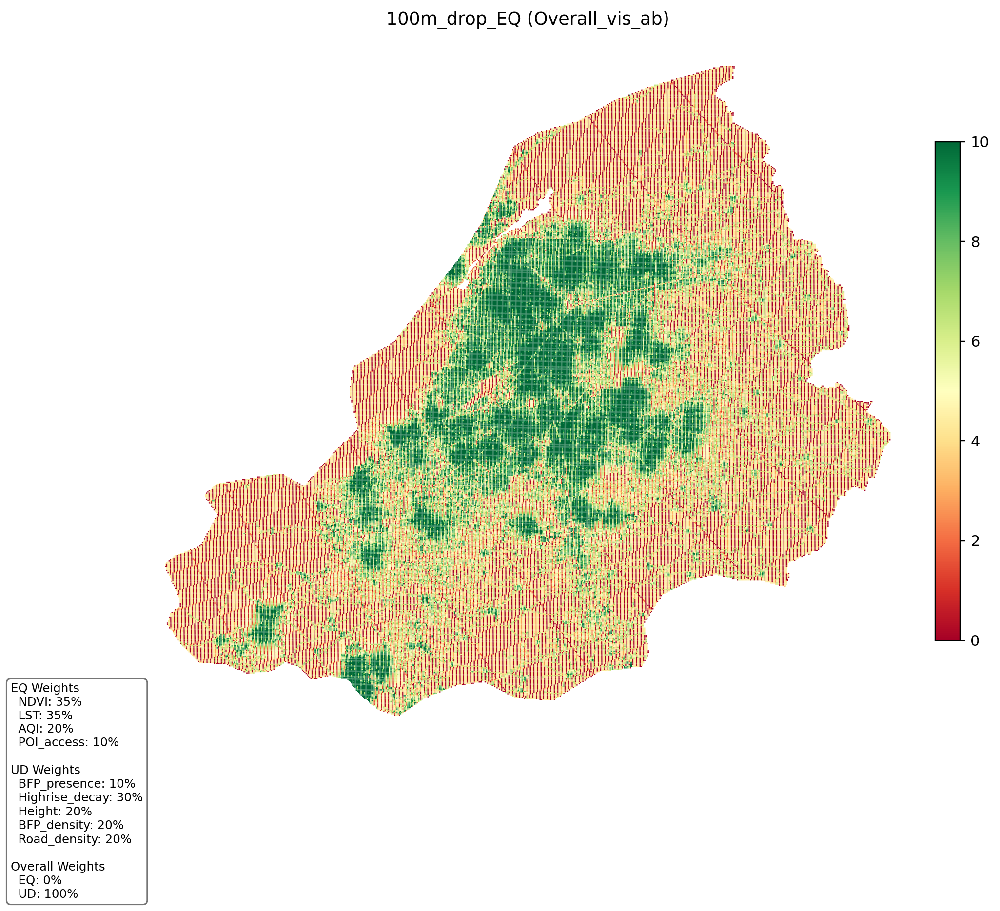
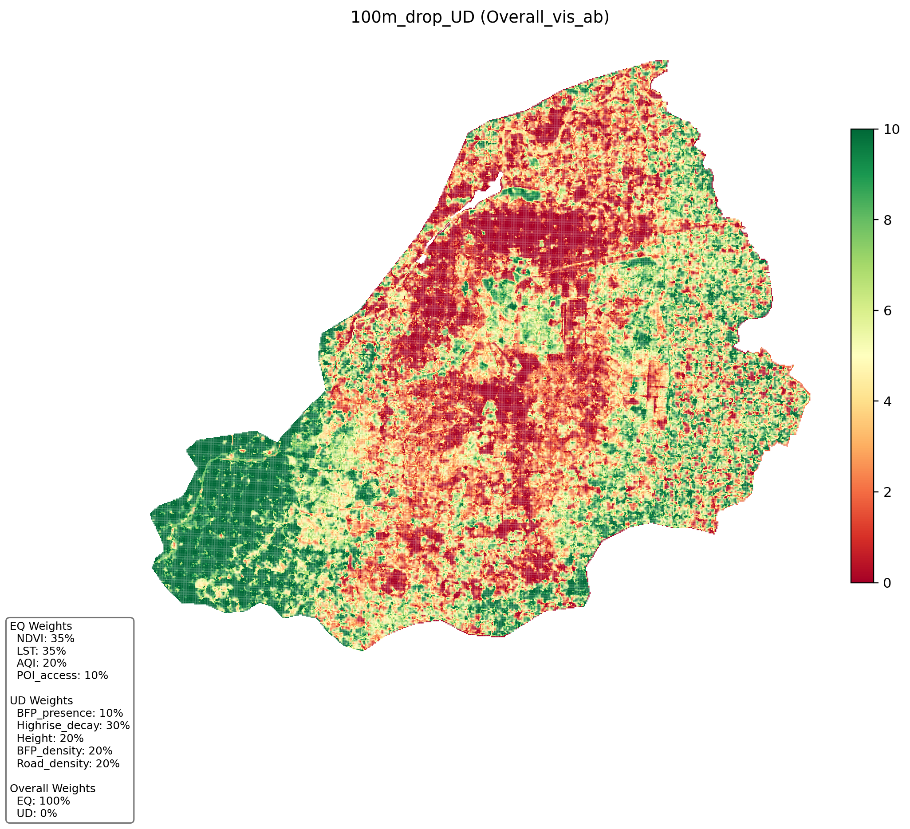
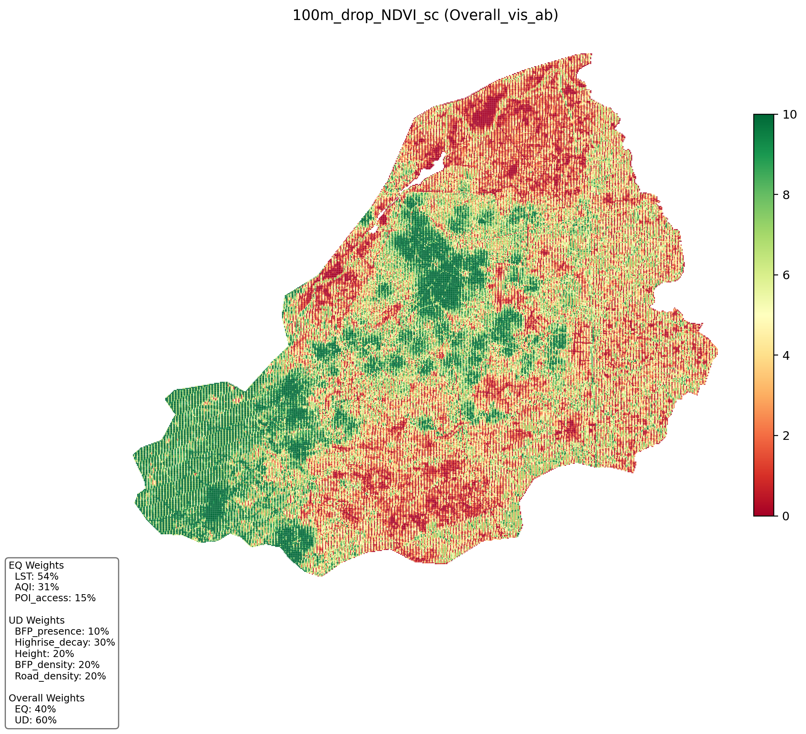
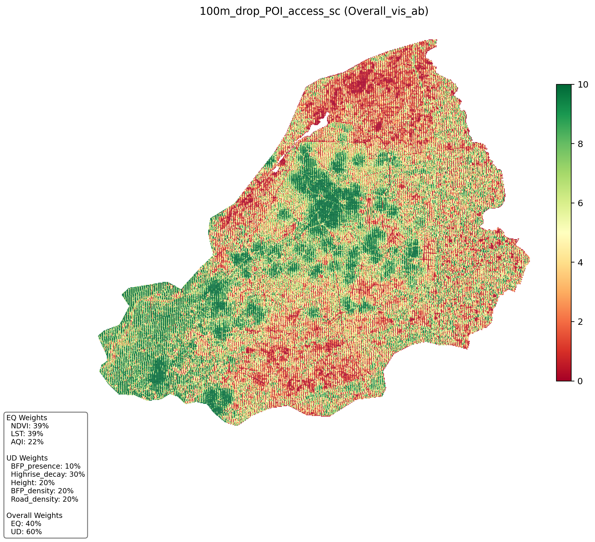
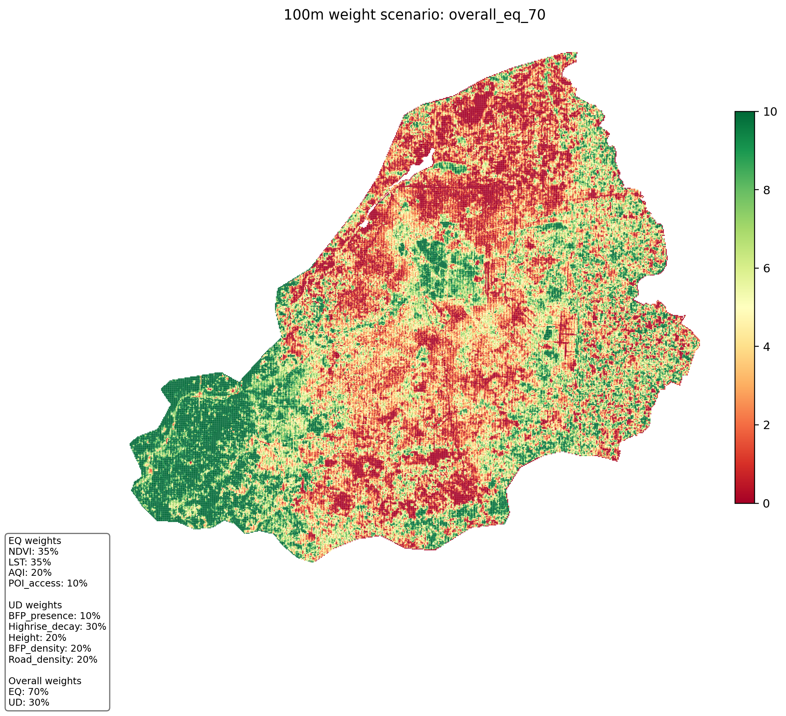
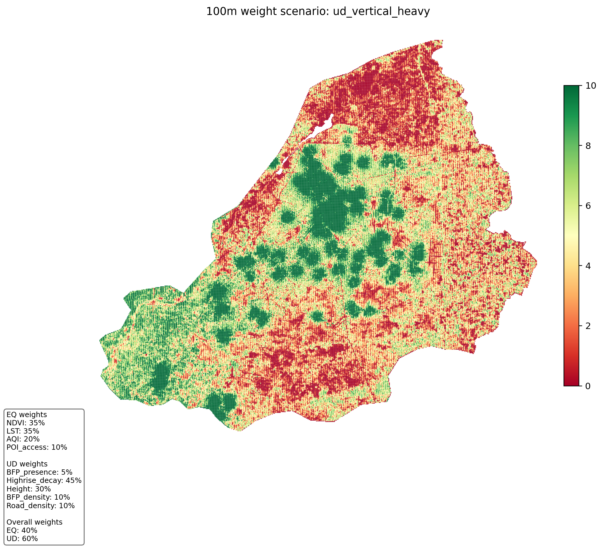

# HUDI Lahore: Urban Quality Index Pipeline

This repository builds a grid-based Urban Quality Index for Lahore from remote sensing, OSM roads/POIs, AQI, and built-form features.

## What this repo does
- Extracts and prepares core spatial layers (NDVI, LST, NL, AQI, buildings, roads, POIs).
- Builds 250m and 100m Lahore grids.
- Computes `EQ`, `UD`, and `Overall` index scores in `notebooks/index.ipynb`.
- Runs two ablation families:
  - metric drop ablations (`notebooks/ablations/`)
  - weight-scenario ablations (`notebooks/ablations_weight_scenarios/`)

## Core formula
- `EQ = weighted average of environmental indicators`
- `UD = weighted average of urban development indicators`
- `Overall = 0.4 * EQ + 0.6 * UD`
- Visualization maps use robust scaling to `[0,10]` (`Overall_vis`).

100m base EQ weights:
- `NDVI_sc 0.35`, `LST_sc 0.35`, `AQI_sc 0.20`, `POI_access_sc 0.10`

UD weights:
- `BFP_presence_sc 0.10`, `Highrise_decay_sc 0.30`, `Height_sc 0.20`, `BFP_density_sc 0.20`, `Road_density_sc 0.20`

## Repository structure
- `notebooks/index.ipynb` main integration + index + ablations
- `notebooks/POI/` POI fetch + accessibility surface
- `notebooks/OSM/` roads/OSM preparation
- `notebooks/AQI/`, `notebooks/NDVI/`, `notebooks/LST/`, `notebooks/NL/` source-specific processing
- `figs/` static figures for documentation/paper
- `DATA_INVENTORY.md` dataset-level file list, sources, and resolutions

## Main outputs
- `notebooks/lahore_index_250m.geojson`
- `notebooks/lahore_index_100m.geojson`
- `notebooks/lahore_index_250m.csv`
- `notebooks/lahore_index_100m.csv`
- `notebooks/lahore_index_map_final.html`

## Quick run order
1. Generate or verify source layers in domain notebooks (`AQI`, `NDVI`, `LST`, `NL`, `POI`, `OSM`).
2. Open `notebooks/index.ipynb`.
3. Run all cells top-to-bottom.
4. Check ablations:
   - `notebooks/ablations/*.png`
   - `notebooks/ablations_weight_scenarios/*.png`

## Figures
### Data/Method snapshots

### Metric-drop ablations (100m)

### Weight-scenario ablations (100m)

